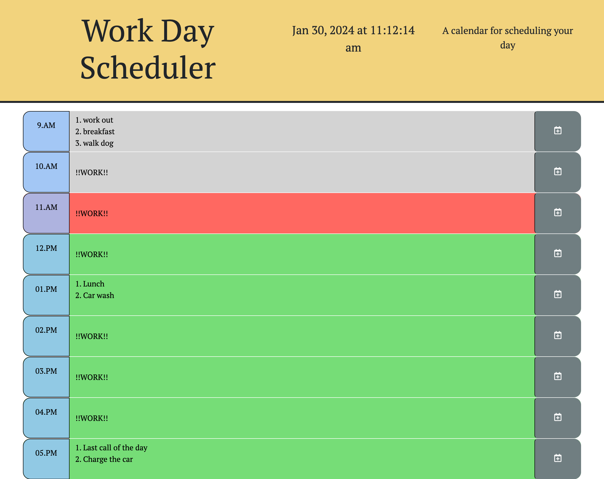

# work-day-scheduler

## Description 

The inspiration for this project came from needing the ability to schedule my day accordingly with ease. A simply calender app which saves and stores your tasks to local storage, then displays those events to the page so it can be recalled when the tab is closed/re-opened. The coding for this project is a nice guide for starting a basic work-day-scheduler app which also displays the current date and time.

## Link to deploy app

[Work Day Scheduler][def]

[def]: https://nicoinlalaland.github.io/work-day-scheduler/